# securecastle-grc-model

> Fictional enterprise GRC data model simulating governance workflows, risk tracking, employee and asset lifecycle management, and legal hold processes.

---

## Overview

Secure Castle, Co. is a fictional 50-person organization used as the foundation for this GRC data model. The model is designed to simulate how a real governance, risk, and compliance program operates at the data level covering everything from employee onboarding and device lifecycle management to risk identification, retention policy enforcement, and litigation hold workflows.

This project is intended as a portfolio and educational resource demonstrating relational database design, data governance principles, and GRC documentation practices.

---

## Tech Stack

| Tool | Purpose |
|---|---|
| **NocoDB** | No-code database interface for managing and visualizing records |
| **Supabase** | PostgreSQL backend for relational data storage |
| **GitHub** | Version control and project documentation |

---

## Live Demo

The following public views are available for interactive browsing — no login required.

| Table | View | Link |
|---|---|---|
| Data Assets | Grouped by Data Type | [View →](https://app.nocodb.com/nc/view/7d0c83fe-d849-49e2-9ef6-0a71ed4d5111) |
| Risk Register | High Priority Active Risks | [View →](https://app.nocodb.com/nc/view/b333e2f3-bc7c-49e0-8605-ba0148ba3790) |
| Systems | Grouped by Business Domain | [View →](https://app.nocodb.com/nc/view/00de2c6f-0c1b-44d1-b7a9-cf83fa4436ac) |
| Employee Directory | Active Employees Only | [View →](https://app.nocodb.com/nc/view/4b3aa865-993c-4e2d-bdc3-290e91956128) |

---

## Data Model

The model consists of seven relational tables:

| Table | Description |
|---|---|
| `employee_directory` | Central registry of all employees and contractors. Tracks identity, contact info, employment status, access level, and policy acknowledgment. |
| `devices` | Inventory of all organizational devices assigned to employees. Tracks hardware details, security posture, patch status, and lifecycle dates. |
| `device_events` | Log of security and operational events associated with devices — loss, theft, damage, repair, retirement, and reassignment. |
| `systems` | Catalog of all organizational systems and applications with ownership, environment, criticality, and data classification. |
| `data_assets` | Inventory of data assets including location, classification, hosting system, ownership, and legal hold status. |
| `retention_policy` | Defines retention rules by data type including period, regulatory basis, legal hold requirements, and review dates. |
| `risk_register` | Central log of identified organizational risks with likelihood, impact, control gaps, mitigation plans, and ownership. |

### Relationships

- `employee_directory` ← `devices` (device_owner_id)
- `employee_directory` ← `systems` (owner_entity_id)
- `employee_directory` ← `data_assets` (custodian_entity_id)
- `employee_directory` ← `risk_register` (risk_owner_entity_id)
- `employee_directory` → `employee_directory` (reports_to_id — self-referencing hierarchy)
- `devices` ← `device_events` (device_id)
- `systems` ← `data_assets` (hosting_system_id)
- `data_assets` ← `retention_policy` (data_assets)
- `data_assets` ← `risk_register` (related_data_asset_id)
- `systems` ← `risk_register` (related_system_id)

---

## Key Workflows Simulated

**Employee Lifecycle**
Full onboarding to offboarding flow including device assignment within two days of start date, access level provisioning, MFA enforcement, policy acknowledgment tracking, and access revocation on termination or suspension.

**Device Lifecycle**
Device assignment, patch management, MDM enrollment, end-of-life planning (4-year laptops, 5-year desktops, 3-year mobile phones), repair and loaner tracking, and secure decommission with return date logging.

**Risk Management**
Risk identification, likelihood and impact scoring, control gap documentation, mitigation planning, ownership assignment, and status tracking across Open, In Progress, Mitigated, Accepted, and Closed states.

**Data Governance**
Data asset classification (Public, Internal, Confidential, Restricted), retention policy enforcement by data type and regulatory basis (GDPR, HIPAA, SOX, NIST), and custodian accountability through the IT and Security departments.

**Legal Hold**
Litigation hold notice workflow issued at the direction of outside legal counsel and administered by the Governance Manager. Legal hold status tracked at the data asset level with start date and reason documented.

---

## Organization Structure

High-level reporting structure by department. All directors report to the CEO.

```mermaid
flowchart TD
    CEO["🏰 Mickey Mouse\nCEO"]

    CEO --> FIN["💰 Minnie Mouse\nDirector — Finance"]
    CEO --> HR["👥 Maleficent Dark\nDirector — HR"]
    CEO --> IT["💻 Simba Lion\nDirector — IT"]
    CEO --> SEC["🛡️ John Smith\nDirector — Security"]
    CEO --> GOV["📋 Mary Poppins\nDirector — Governance"]
    CEO --> OPS["⚙️ Pocahontas Nature\nDirector — Operations"]

    FIN --> FIN1["Donald Duck · Analyst"]
    FIN --> FIN2["Hook Captain · Analyst"]
    FIN --> FIN3["Tiana Chef · Specialist"]
    FIN --> FIN4["Naveen Prince · Analyst"]

    HR --> HR1["Tinker Bell\nManager — HR"]
    HR --> HR2["Jafar Vizier\nManager — Learning"]
    HR1 --> HR3["Aurora Rose · Specialist"]
    HR1 --> HR4["Phillip Prince · Analyst"]
    HR2 --> HR5["Aladdin Street · Specialist"]
    HR2 --> HR6["Megara Hero · Analyst"]

    IT --> IT1["Anna Arendelle\nManager — IT"]
    IT --> IT2["Peter Pan\nManager — IT"]
    IT1 --> IT3["Nala Lion · Engineer"]
    IT1 --> IT4["Perdita Dog · Engineer"]
    IT1 --> IT5["Facilier Doctor · Engineer"]
    IT2 --> IT6["Pongo Dog · Engineer"]
    IT2 --> IT7["Hercules Hero · Engineer"]
    IT2 --> IT8["Jane Porter · Specialist"]

    SEC --> SEC1["Wendy Darling\nManager — Security"]
    SEC1 --> SEC2["Scar Lion · Analyst"]
    SEC1 --> SEC3["Adam Beast · Analyst"]
    SEC1 --> SEC4["Hans Prince · Specialist"]
    SEC1 --> SEC5["Clayton Hunter · Specialist"]

    GOV --> GOV1["Belle Beauty\nManager — Governance"]
    GOV --> GOV2["Kristoff Ice\nManager — Governance"]
    GOV1 --> GOV3["Daisy Duck · Analyst"]
    GOV1 --> GOV4["Moana Ocean · Analyst"]
    GOV2 --> GOV5["Maui Demigod · Specialist"]

    OPS --> OPS1["Ariel Mermaid\nManager — Operations"]
    OPS1 --> OPS2["Eric Prince · Specialist"]
    OPS1 --> OPS3["Gaston Hunter · Specialist"]
    OPS1 --> OPS4["Jasmine Princess · Analyst"]
    OPS1 --> OPS5["Rapunzel Corona · Analyst"]
    OPS1 --> OPS6["Eugene Rider · Analyst"]
    OPS1 --> OPS7["Mufasa Lion · Specialist"]
    OPS1 --> OPS8["Elsa Arendelle · Specialist"]
    OPS1 --> OPS9["Hades Underworld · Analyst"]
    OPS1 --> OPS10["Goofy Goof · Analyst"]
```

---

## Documentation

### Available

| Document | Description | Classification |
|---|---|---|
| [GRC Data Reference Manual](docs/grc_data_reference_manual.xlsx) | Full data dictionary including table definitions, field types, allowed values, linked record references, and document control | Internal |
| [Litigation Hold Notice Template](docs/grc_data_reference_manual.docx) | Attorney-client privileged template notice for litigation hold events | Confidential |

### In Progress

| Document | Description | Classification |
|---|---|---|
| System Inventory | Detailed inventory of all 19 organizational systems with linked data assets and custodians | Internal |
| Data Retention Policy | Retention rules, regulatory basis, and disposal procedures for all 7 data types | Confidential |
| Litigation Response Team Manual | Internal procedures for responding to litigation holds | Confidential |

---

## Organization

Secure Castle, Co. is a fictional 50-person company with the following departments:

`Finance` `HR` `IT` `Security` `Governance` `Operations` `Learning` `Knowledge`

Legal holds and compliance obligations are managed by the **Governance Department**, with outside legal counsel engaged for litigation matters. IT manages technical custodianship of data assets; Security manages security-domain assets.

---

## Project Status

Active — data model is fully built and populated with fictional sample data across all seven tables. Documentation suite is in progress.

---

## License

This project is licensed under the [MIT License](LICENSE).

---

## Author

Built by Linda Vue, a GRC and data governance professional with a focus on relational database design, compliance frameworks, and enterprise risk management workflows.
LinkedIn → www.linkedin.com/in/lindavue
